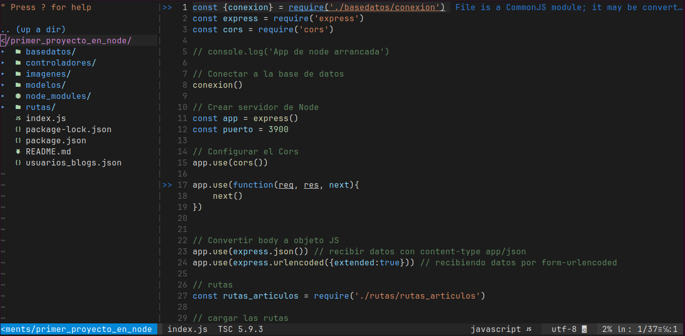

# Vim Portable Configuration 🚀



Configuración **portable y reproducible** de Vim, pensada para usar la **misma experiencia de edición** en cualquier computadora sin modificar el Vim del sistema.

Este repositorio permite clonar, ejecutar y trabajar con Vim usando:
- configuración propia
- plugins gestionados con vim-plug
- soporte LSP/autocompletado con CoC
- integración con Git desde Vim

---

## 🎯 Objetivo del proyecto

El objetivo de este repositorio es:

- Tener una configuración de Vim **portable**
- No depender de `~/.vim` ni `~/.vimrc`
- Poder usar Vim en cualquier equipo con solo clonar el repo
- Mantener un entorno limpio y controlado

---

## 🧩 ¿Qué incluye esta configuración?

- 🎨 Temas de color (Code Dark, Monokai)
- 📁 Explorador de archivos (NERDTree)
- 🔍 Búsqueda avanzada (fzf)
- 🧠 Autocompletado y LSP (coc.nvim)
- 💬 Terminal integrada (floaterm)
- 🧭 Git dentro de Vim (vim-fugitive)
- ✨ Barra de estado (vim-airline)
- 🌈 Iconos (vim-devicons)

---

## 📂 Estructura del proyecto
```text
vim-portable/
├── vim.sh                 # Script para lanzar Vim portable
├── vimrc                  # Configuración principal de Vim
├── coc-settings.json      # Configuración de CoC (LSP)
├── .gitignore
├── README.md
├── vim/
│   ├── autoload/
│   │   └── plug.vim       # Gestor de plugins (vim-plug)
│   └── plugged/           # Plugins instalados (ignorado por Git)
```
---

##  📝 Requisitos 

- Vim 8+
- Git
- Node.js(requerido para coc.nvim)
- Nerd font (para iconos en el terminal)

---

## ⚙️  Instalación

Clona el repositorio y luego entra al proyecto:

```bash
git clone https://github.com/Edavila2002/vim-portable.git
cd vim-portable
```

Lanza Vim portable:

```bash
./vim.sh 
```

Dentro de Vim instala los Plugins:

```vim
:PlugInstall
```
---

## 🧠  Uso diario

Puedes abrir archivos o carpetas directamente:

```bash
./vim.sh archivo.js
./vim.sh 
```

---

## 🧭 Comandos Git dentro de Vim

Esta configuración incluye **vim-fugitive**, por lo que puedes usar:

```vim
:Git status
:Git add archivo
:Git commit
:Git push
```
---

## 🔌 Plugins utilizados

Esta configuración utiliza los siguientes plugins y proyectos open-source:

- **vim-plug**  
  https://github.com/junegunn/vim-plug

- **coc.nvim** (LSP y autocompletado)  
  https://github.com/neoclide/coc.nvim

- **NERDTree** (explorador de archivos)  
  https://github.com/preservim/nerdtree

- **fzf / fzf.vim** (búsqueda fuzzy)  
  https://github.com/junegunn/fzf  
  https://github.com/junegunn/fzf.vim

- **vim-airline** (barra de estado)  
  https://github.com/vim-airline/vim-airline

- **vim-devicons** (iconos)  
  https://github.com/ryanoasis/vim-devicons

- **vim-fugitive** (Git en Vim)  
  https://github.com/tpope/vim-fugitive

- **vim-floaterm** (terminal flotante)  
  https://github.com/voldikss/vim-floaterm

---

## 🧠 Nota sobre Coc (LSP)

Este proyecto usa **coc.nvim** para autocompletado y soporte LSP.

Dependiendo del lenguaje que uses, es posible que debas instalar
las extensiones correspondientes dentro de Vim, por ejemplo:

```vim
:CocInstall coc-tsserver
:CocInstall coc-pyright
:CocInstall coc-clangd

