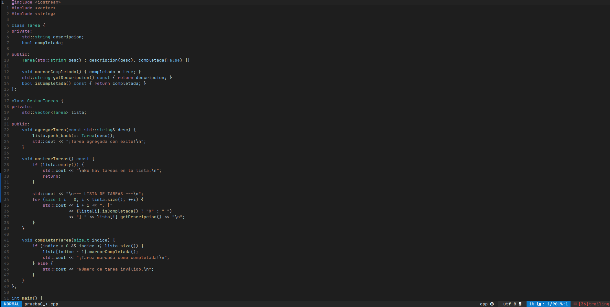

# Vim Portable AI IDE 🚀🤖



Configuración **portable y reproducible** de Vim, ahora potenciada con **Inteligencia Artificial**, pensada para usar la **misma experiencia de edición** en cualquier computadora sin modificar el Vim del sistema.

Este repositorio permite clonar, ejecutar y trabajar con Vim usando:
- configuración propia
- plugins gestionados con vim-plug
- soporte LSP/autocompletado con CoC
- **autocompletado con IA (Codeium)**
- integración con Git desde Vim

---

## 🎯 Objetivo del proyecto

El objetivo de este repositorio es:

- Tener una configuración de Vim **portable**
- No depender de `~/.vim` ni `~/.vimrc`
- Poder usar Vim en cualquier equipo con solo clonar el repo
- Mantener un entorno limpio y controlado

---

## 🧩 ¿Qué incluye esta configuración?

- 🎨 Temas de color (Code Dark, Monokai)
- 📁 Explorador de archivos (NERDTree)
- 🔍 Búsqueda avanzada (fzf)
- 🧠 Autocompletado y LSP (coc.nvim)
- 🤖 **Inteligencia Artificial Gratuita (Codeium)**
- 💬 Terminal integrada (floaterm)
- 🧭 Git dentro de Vim (vim-fugitive)
- ✨ Barra de estado (vim-airline)
- 🌈 Iconos (vim-devicons)

---

## 📂 Estructura del proyecto
La estructura incluye ahora carpetas para almacenar el motor de la IA de forma local y portable:

```text
vim-portable/
├── vim.sh                 # Script para lanzar Vim portable
├── vimrc                  # Configuración principal de Vim
├── coc-settings.json      # Configuración de CoC (LSP)
├── .gitignore
├── README.md
├── bin/                   # 🤖 MOTOR DE IA (Se descarga aquí automáticamente)
├── .codeium/              # 🤖 BASE DE DATOS LOCAL DE LA IA
└── vim/
    ├── autoload/
    │   └── plug.vim       # Gestor de plugins (vim-plug)
    └── plugged/           # Plugins instalados (ignorado por Git)

```

---
## 🖥️ Sistemas operativos compatibles


Esta configuración de Vim está diseñada para sistemas Unix-like y ha sido probada en:


- ✅ Linux (Ubuntu, Arch, Fedora, etc.)


- ✅ macOS


El script vim.sh detecta automáticamente el sistema y resuelve correctamente

la ruta del proyecto, incluso cuando se ejecuta mediante enlaces simbólicos.


---


##  📝 Requisitos 


- Vim 8+

- Git

- Node.js(requerido para coc.nvim)

- Nerd font (para iconos en el terminal)


---


## ⚙️  Instalación


Clona el repositorio y luego entra al proyecto:


```bash

git clone https://github.com/Edavila2002/vim-portable.git

cd vim-portable

```


Lanza Vim portable:


```bash

./vim.sh 

```


Dentro de Vim instala los Plugins:


```vim

:PlugInstall

```


---
## 🤖 Activación de la IA (Solo la primera vez)

Para que la Inteligencia Artificial empiece a escribir código por ti, necesitas autorizarla una única vez. Esto descargará el motor de IA dentro de la carpeta bin/ de este proyecto:
```

    Abre Vim: ./vim.sh

    Ejecuta el comando: :Codeium Auth

    Se abrirá tu navegador. Copia el token que te den.

    Pégalo en Vim y pulsa Enter.
```

---

---
## ⌨️ Atajos de Teclado (IA y Autocompletado)

Hemos configurado la tecla TAB para que sea inteligente y maneje tanto el menú de autocompletado clásico como la IA sin conflictos:

Ctrl + j: Ver siguiente opción de la IA.

Ctrl + k: Ver opción anterior de la IA.

Ctrl + x: Descartar la sugerencia actual.

Ctrl + l: Forzar aceptación de la IA manualmente.

---


---


## 🧠  Uso diario


Puedes abrir archivos o carpetas directamente:


```bash

./vim.sh archivo.js

./vim.sh 

```


---


## 🌍 Uso global (opcional)


Por defecto, Vim-portable se ejecuta desde la carpeta del repositorio. Esto funciona correctamente, pero requiere estar ubicado dentro del proyecto o escribir la ruta absoluta al script.


```bash

./vim.sh archivo.txt

```


Si deseas ejecutar el mismo vim.sh desde cualquier carpeta del sistema, puedes habilitar el uso global creando un enlace simbólico.


En tu sistema verifica que tengas la carpepta *** ~/.local/bin ***, si no la tienes, creala:


```

mkdir -p ~/.local/bin

```


Dentro de la carpeta crea un enlace simbólico a vim.sh, debes poner la ruta en donde clonaste el repositorio:


```


ln -s ruta al repositorio/vim-portable/vim.sh ~/.local/bin/vim.sh


```

Un enlace simbólico no copia archivos ni modifica el repositorio;

simplemente le indica al sistema dónde se encuentra el script original.


---


##  👍 Uso desde cualquier carpeta


Puedes ejecutar vim-portable desde cualquier ubicación:


```

vim.sh archivo.c

vim.sh archivo.py

vim.sh .

```


El comportamiento será exactamente el mismo que al ejecutar ./vim.sh

desde el repositorio.


---


## 🧭 Comandos Git dentro de Vim


Esta configuración incluye **vim-fugitive**, por lo que puedes usar:


```vim

:Git status

:Git add archivo

:Git commit

:Git push

```


---


## 🧠 Nota sobre Coc (LSP)


Este proyecto usa **coc.nvim** para autocompletado y soporte LSP.


Dependiendo del lenguaje que uses, es posible que debas instalar

las extensiones correspondientes dentro de Vim, por ejemplo:


```vim

:CocInstall coc-tsserver

:CocInstall coc-pyright

:CocInstall coc-clangd

```


---

---

## 🔌 Plugins utilizados

Esta configuración utiliza los siguientes plugins y proyectos open-source:

- **vim-plug** (Gestor de plugins)  
  https://github.com/junegunn/vim-plug

- **codeium.vim** (Inteligencia Artificial Gratuita)  
  https://github.com/Exafunction/codeium.vim

- **coc.nvim** (LSP y autocompletado)  
  https://github.com/neoclide/coc.nvim

- **NERDTree** (Explorador de archivos)  
  https://github.com/preservim/nerdtree

- **fzf / fzf.vim** (Búsqueda fuzzy instantánea)  
  https://github.com/junegunn/fzf  
  https://github.com/junegunn/fzf.vim

- **vim-airline** (Barra de estado elegante)  
  https://github.com/vim-airline/vim-airline

- **vim-code-dark** (Tema visual estilo VS Code)  
  https://github.com/tomasiser/vim-code-dark

- **vim-monokai** (Tema visual Monokai)  
  https://github.com/ku1ik/vim-monokai

- **nerdcommenter** (Comentar código rápido)  
  https://github.com/preservim/nerdcommenter

- **vim-polyglot** (Resaltado de sintaxis universal)  
  https://github.com/sheerun/vim-polyglot

- **vim-devicons** (Iconos para archivos)  
  https://github.com/ryanoasis/vim-devicons

- **vim-fugitive** (Cliente Git integrado)  
  https://github.com/tpope/vim-fugitive

- **vim-floaterm** (Terminal flotante)  
  https://github.com/voldikss/vim-floaterm

---
